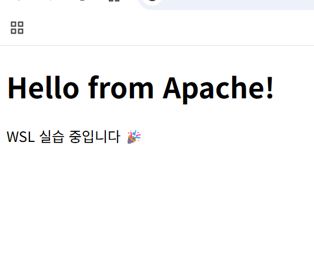

# 오류 해결

- Nginx를 열었더니 Apache2가 실행됨
    1. 먼저 sudo systemctl stop apache2를 친다.
    2. sudo systemctl restart nginx
    3. 페이지를 새로고침한다

- Apache2를 열었더니 Nginx가 실행됨
    1. nginx 페이지를 닫는다.
    2. sudo systemctl stop nginx
    3. sudo systemctl reload apache2
    4. sudo systemctl restart apache2
    5. http://localhost 입력 후 확인한다.